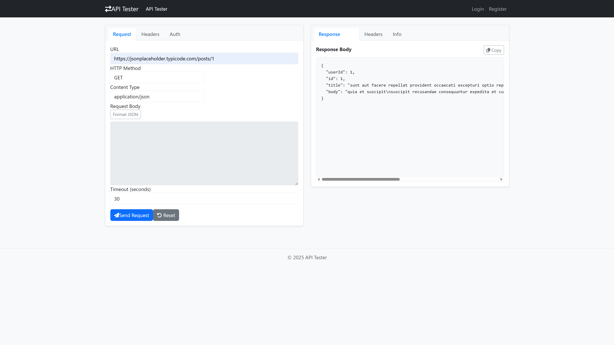

# API Tester - REST Client Application

A full-stack REST API testing tool similar to Postman or Insomnia, built with Angular 19 and .NET 7. Test APIs, save requests, and manage your workflow with a clean, intuitive interface.


## Features

- **HTTP Methods** - Support for GET, POST, PUT, DELETE, PATCH, HEAD, and OPTIONS
- **Authentication** - None, Basic Auth, Bearer Token, and API Key options
- **Custom Headers** - Dynamic key-value header editor
- **Request Body** - JSON body editor with formatting
- **Response Viewer** - Syntax-highlighted JSON with headers and metadata
- **Saved Requests** - Save and organise requests for registered users
- **Response Metrics** - Status codes, response times, and content size
- **User Accounts** - Register and login to persist your requests

## Tech Stack

### Frontend
- **Framework:** Angular 19
- **Language:** TypeScript
- **Styling:** Bootstrap 5, Font Awesome
- **Syntax Highlighting:** highlight.js

### Backend
- **Framework:** .NET 7 Web API
- **Database:** SQLite with Entity Framework Core
- **Authentication:** JWT Bearer tokens
- **Password Hashing:** BCrypt

## Getting Started

### Prerequisites

- Node.js 18.x or higher
- .NET 7 SDK
- Angular CLI (`npm install -g @angular/cli`)

### Backend Setup

```bash
# Navigate to backend directory
cd Backend/ApiTester.Api

# Restore dependencies
dotnet restore

# Run database migrations
dotnet ef database update

# Start the API server
dotnet run
```

The API will be available at `https://localhost:7001` (or configured port)

### Frontend Setup

```bash
# Navigate to frontend directory
cd Frontend/api-tester

# Install dependencies
npm install

# Start development server
ng serve
```

The application will be available at `http://localhost:4200`

## Project Structure

```
├── Backend/
│   └── ApiTester.Api/
│       ├── Controllers/
│       │   ├── ApiTesterController.cs    # Request execution
│       │   ├── AuthController.cs         # User authentication
│       │   └── SavedRequestsController.cs
│       ├── Models/
│       │   ├── User.cs
│       │   ├── SavedRequest.cs
│       │   └── ApiRequestModel.cs
│       ├── Services/
│       │   └── ApiRequestService.cs      # HTTP client logic
│       └── Data/
│           └── AppDbContext.cs
│
├── Frontend/
│   └── api-tester/
│       └── src/app/
│           ├── components/
│           │   ├── api-request/          # Request builder UI
│           │   ├── response-viewer/      # Response display
│           │   ├── saved-requests/       # Saved requests list
│           │   ├── login/
│           │   └── register/
│           ├── services/
│           │   ├── api.service.ts
│           │   └── auth.service.ts
│           └── interceptors/
│               └── auth.interceptor.ts
```

## API Endpoints

### Authentication

| Endpoint | Method | Description |
|----------|--------|-------------|
| `/api/auth/register` | POST | Create new user account |
| `/api/auth/login` | POST | Authenticate and receive JWT |

### API Testing

| Endpoint | Method | Description |
|----------|--------|-------------|
| `/api/tester/execute` | POST | Execute an API request |

### Saved Requests

| Endpoint | Method | Description |
|----------|--------|-------------|
| `/api/saved-requests` | GET | Get user's saved requests |
| `/api/saved-requests` | POST | Save a new request |
| `/api/saved-requests/{id}` | DELETE | Delete a saved request |

## Usage

### Making a Request

1. Enter the target URL in the URL field
2. Select the HTTP method (GET, POST, etc.)
3. Add headers in the Headers tab (optional)
4. Configure authentication in the Auth tab (optional)
5. Add request body in the Request tab for POST/PUT/PATCH
6. Click **Send** to execute the request

### Viewing Responses

The response viewer displays:
- **Body** - JSON response with syntax highlighting
- **Headers** - Response headers in table format
- **Info** - Status code, response time, content type, and size

### Saving Requests

1. Register or login to your account
2. Configure your request
3. Click **Save Request**
4. Access saved requests from the sidebar

## Authentication Flow

```
┌─────────┐         ┌─────────┐         ┌──────────┐
│ Browser │         │ Angular │         │ .NET API │
└────┬────┘         └────┬────┘         └────┬─────┘
     │   Login Form      │                   │
     │──────────────────>│                   │
     │                   │  POST /auth/login │
     │                   │──────────────────>│
     │                   │                   │
     │                   │   JWT Token       │
     │                   │<──────────────────│
     │                   │                   │
     │   Store in        │                   │
     │   localStorage    │                   │
     │<──────────────────│                   │
     │                   │                   │
     │   API Request     │                   │
     │──────────────────>│                   │
     │                   │ + Bearer Token    │
     │                   │──────────────────>│
     │                   │                   │
```

JWT tokens are stored in localStorage and automatically attached to requests via Angular's `authInterceptor`.

## Configuration

### Backend (appsettings.json)

```json
{
  "Jwt": {
    "Key": "your-secret-key-min-32-characters",
    "Issuer": "ApiTester",
    "Audience": "ApiTesterUsers",
    "ExpiryDays": 7
  },
  "ConnectionStrings": {
    "DefaultConnection": "Data Source=apitester.db"
  }
}
```

### Frontend (environment.ts)

```typescript
export const environment = {
  production: false,
  apiUrl: 'https://localhost:7001/api'
};
```

## Deployment

### Backend - Render

1. Create a new Web Service
2. Connect your repository
3. Configure:
   - **Build Command:** `dotnet publish -c Release -o out`
   - **Start Command:** `dotnet out/ApiTester.Api.dll`

### Frontend - Vercel

The project includes a `vercel.json` configuration:

```json
{
  "rewrites": [
    { "source": "/(.*)", "destination": "/index.html" }
  ]
}
```

Deploy with:
```bash
vercel --prod
```

### Docker

```dockerfile
# Backend
FROM mcr.microsoft.com/dotnet/aspnet:7.0 AS base
WORKDIR /app
EXPOSE 80

FROM mcr.microsoft.com/dotnet/sdk:7.0 AS build
WORKDIR /src
COPY ["ApiTester.Api.csproj", "."]
RUN dotnet restore
COPY . .
RUN dotnet build -c Release -o /app/build

FROM build AS publish
RUN dotnet publish -c Release -o /app/publish

FROM base AS final
WORKDIR /app
COPY --from=publish /app/publish .
ENTRYPOINT ["dotnet", "ApiTester.Api.dll"]
```

## Screenshots



## Contributing

1. Fork the repository
2. Create a feature branch (`git checkout -b feature/amazing-feature`)
3. Commit your changes (`git commit -m 'Add amazing feature'`)
4. Push to the branch (`git push origin feature/amazing-feature`)
5. Open a Pull Request

## Roadmap

- [ ] Request history
- [ ] Collections/folders for organising requests
- [ ] Environment variables
- [ ] Import/export requests (Postman format)
- [ ] WebSocket support
- [ ] GraphQL support
- [ ] Response comparison

## License

This project is licensed under the MIT License - see the [LICENSE](LICENSE) file for details.

## Acknowledgements

- [Angular](https://angular.io/) - Frontend framework
- [.NET](https://dotnet.microsoft.com/) - Backend framework
- [highlight.js](https://highlightjs.org/) - Syntax highlighting
- [Bootstrap](https://getbootstrap.com/) - UI framework